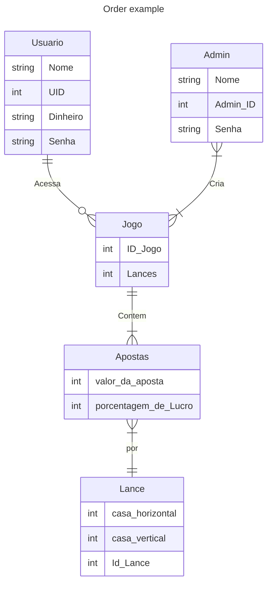

```mermaid
---
title: Order example
---
erDiagram
    Usuario ||--o{ Jogo :  Acessa
    Admin |{--|{ Jogo :  Cria
    Jogo ||--|{ Apostas: Contem
    Apostas |{--|| Lance: por

  Usuario {
        string Nome
        int UID
        string Dinheiro
        string Senha
    }

      Admin {
         string Nome
        int Admin_ID
        string Senha
    }

      Jogo {
        int ID_Jogo
        int Lances
    }

      Apostas {
        int valor_da_aposta
        int porcentagem_de_Lucro
        
    }

      Lance {
        int casa_horizontal
        int casa_vertical
        int Id_Lance
    }
```